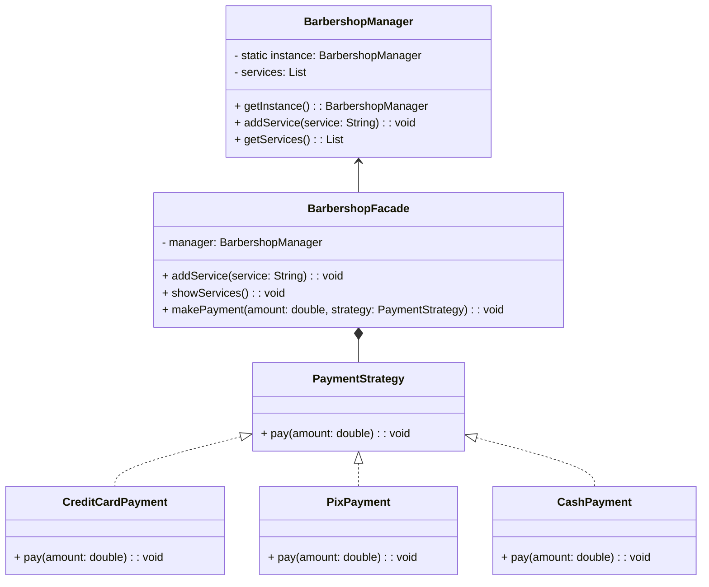
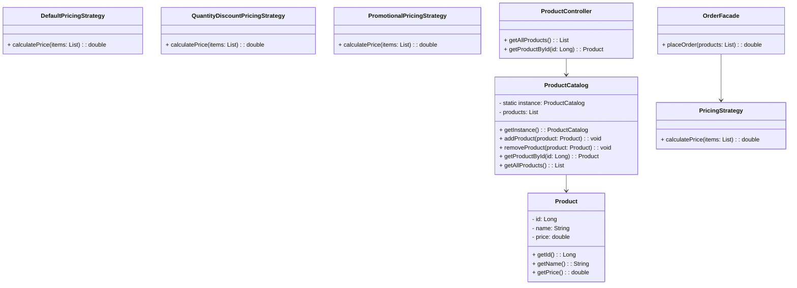

# Sistema de Gerenciamento de Barbearia e E-commerce

Este projeto tem por finalidade explora o uso dos padrões de projeto Singleton, Strategy e Facade para implementar um sistema de gerenciamento de uma barbearia e um E-commerce com Spring.]

## Sistema de Gerenciamento de Barbearia

### Padrões de Projeto Utilizados
1. **Singleton**: Classe BarbershopManager é utilizada para gerenciar os serviços oferecidos pela barbearia, garantindo que apenas uma instância do gerenciador exista.
2. **Strategy**: Interface PaymentStrategy e suas implementações (CreditCardPayment, PixPayment, CashPayment) são utilizadas para processar diferentes métodos de pagamento.
3. **Facade**: Classe BarbershopFacade fornece uma interface simplificada para acessar as funcionalidades da barbearia, como adicionar serviços, exibir serviços disponíveis e realizar pagamentos.

  
## Sistema de E-commerce com Spring Framework

### Padrões de Projeto Utilizados
1. **Singleton**: Classe ProductCatalog é utilizada para gerenciar o catálogo de produtos do e-commerce, garantindo que apenas uma instância do catálogo exista e seja acessível globalmente.
2. **Strategy**: Interface PricingStrategy e suas implementações (DefaultPricingStrategy, QuantityDiscountPricingStrategy, PromotionalPricingStrategy) são utilizadas para calcular o preço dos pedidos de acordo com diferentes estratégias de precificação.
3. **Facade**: Classe OrderFacade fornece uma interface simplificada para realizar pedidos, calcular preços e acessar informações do catálogo de produtos.

